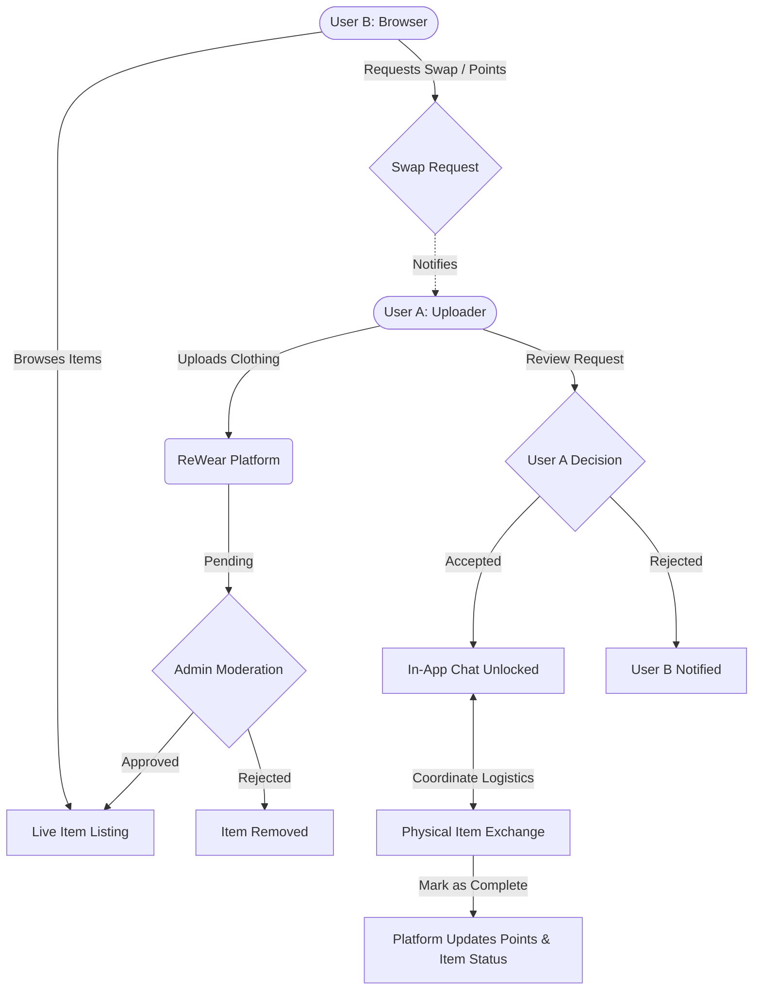

# 🧵 ReWear – Community Clothing Exchange Platform


**ReWear** is a web-based platform built to foster sustainable fashion by enabling users to exchange unused clothing through direct swaps or a point-based redemption system. It encourages environmentally conscious consumption and aims to reduce textile waste by promoting the reuse of wearable garments within a community.

---

## 🔑 Key Features

### ✅ User Experience & Authentication
- **Secure Authentication:** Email/password-based sign-up and login utilizing JWT.
- **Protected Routes:** Ensuring privacy and security for authenticated user access.
- **User Dashboard:** View and manage profile details, track points balance, monitor uploaded items, and review ongoing/completed swaps.
- **Favorites System:** Bookmark items with a single click and access them quickly from your dashboard.

### 👗 Core Platform Functionality
- **Landing Page:** Introduces the ReWear mission with clear calls-to-action and a visually appealing featured items carousel.
- **Item Exchange:** Request direct clothing swaps or redeem items using platform points.
- **Detailed Item Pages:** Full item descriptions, responsive image galleries, uploader details, and real-time availability status.
- **Add New Items:** Seamless upload process supporting multiple images, categories, condition tags, and descriptions.

### 💬 Engagement & Moderation
- **Global Messaging System:** In-platform chat to initiate conversations after a swap request, keeping communication secure and streamlined.
- **Admin Panel:** Lightweight moderation interface to review, approve, or reject item listings and maintain community content quality.

---

## 🔄 User-to-User Exchange Flow



---

## 🌍 Tech Stack

- **Frontend:** React.js, Tailwind CSS
- **Backend:** Node.js, Express.js
- **Database:** MongoDB (Mongoose ODM)
- **Authentication:** JSON Web Tokens (JWT)
- **Real-Time Communication:** Socket.IO / Firebase
- **Deployment Strategy:** Vercel (Frontend) & Render/Railway (Backend)


## 🚀 Getting Started

*(Instructions for cloning, installing dependencies, and running the project locally will go here as the project develops.)*

```bash
# Clone the repository
git clone https://github.com/10vulture1005/ReWear-Community-Clothing-Exchange.git

# Navigate into the project directory
cd ReWear-Community-Clothing-Exchange

# Install dependencies (Example)
npm install
```

---
*Built with ❤️ for a more sustainable future in fashion.*
